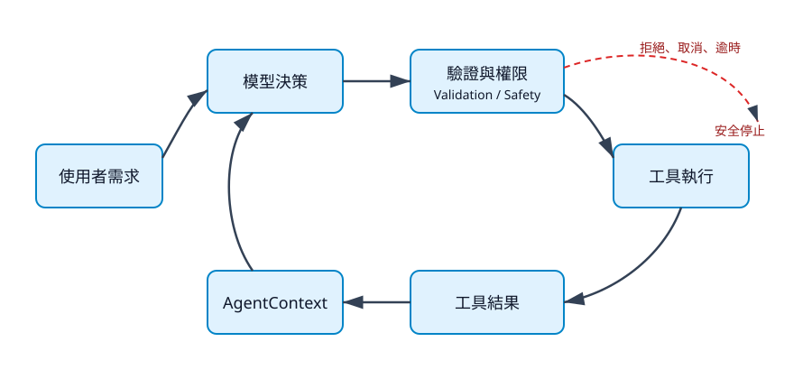

# 1. 聊天機器人為什麼還不是 Agent

## 本章目標

讀完本章，你應能分辨「一次回答」與「可觀察、可控制的行動迴圈」，並說明 Coding Agent 為什麼需要工具、狀態與停止條件。你也會在不需要 API Key 的情況下，完成第一個五分鐘安全體驗。

## 你真正想解決的問題

假設你對聊天模型說：「把專案裡的加法改成乘法，執行測試，確認沒有破壞其他功能。」模型可以回覆一段看似合理的修改建議，但文字回答不等於工作完成。要完成任務，系統至少必須：

1. 知道要讀哪個檔案。
2. 取得目前檔案內容，而不是憑空猜測。
3. 修改明確位置。
4. 執行測試並取得真實結果。
5. 根據成功或失敗決定下一步。
6. 在越界、逾時或回合過多時停止。

聊天機器人主要產生回答；Agent 則把回答放進一個受控制的行動閉環。

## 從一次回答到行動閉環

一般聊天流程很短：

```text
使用者訊息 → 模型 → 文字回答
```

Coding Agent 多了工具與回饋：



文字摘要：使用者需求先進入模型；模型若提出工具呼叫，系統會先驗證與檢查權限，再執行工具。工具結果回到 Context，模型根據真實結果繼續決策。沒有工具呼叫、收到取消、輸出被截斷或超過最大回合數時，流程停止。

關鍵不在於模型「看起來很聰明」，而在於每一個狀態轉換都可以被觀察、測試與中止。

## 五分鐘安全體驗

本書的範例使用 `FakeModel`，不連線到付費服務，也不需要設定 API Key。先在 Repository 根目錄執行：

```bash
uv run python examples/v00_chatbot_baseline.py
uv run python examples/v01_fake_model_loop.py
```

預期看到：

```text
這只是一次模型回應。
計算結果是 5。
```

V0 只有一次模型回應；V1 則先收到 Calculator 工具呼叫，把工具結果放回 Context，再取得最終答案。這兩行輸出的差別，就是本書要逐步拆解的核心。

若命令失敗，先不要加入真實模型或檔案工具。依順序檢查：

1. 是否位於專案根目錄。
2. `uv run pytest -q` 是否能啟動。
3. 錯誤屬於環境、import、測試失敗，還是工具執行失敗。
4. 使用 `Ctrl+C` 停止卡住的命令；不要用系統管理員權限重跑未知命令。

## Agent 與自動化腳本有何不同

固定腳本預先知道每一步，例如「讀 A、改 B、跑 C」。Agent 則由模型根據 Context 選擇下一個工具，因此能處理較多變的任務，但也增加不確定性。

| 系統 | 下一步由誰決定 | 優點 | 主要風險 |
|---|---|---|---|
| 聊天模型 | 模型產生文字 | 簡單、回應快 | 沒有真實執行證據 |
| 固定腳本 | 開發者預先寫死 | 可預測、容易稽核 | 難處理未預期情況 |
| Coding Agent | 模型在受限工具中選擇 | 能根據結果調整 | 可能選錯工具、重複或越界 |

因此，Agent 不是「讓模型自由操作電腦」，而是「讓模型在明確邊界內提出下一個動作」。

## 第一個可測試切片

V1 使用 `FakeModel` 預先提供兩個回應：第一個要求 Calculator，第二個產生最終答案。測試不需要模擬網路：

```bash
uv run pytest tests/test_agent_loop.py -q
```

這個切片已經包含 Agent 最重要的資料流：

```text
UserMessage
  → AssistantMessage(tool_calls=[...])
  → ToolResultMessage
  → AssistantMessage(最終答案)
```

模型供應商日後可以替換，但這個流程的測試不必跟著重寫。

## 三個停止條件

最小 Agent 至少要有三種停止方式：

1. 正常完成：assistant 沒有要求工具。
2. 保護性停止：達到 `max_turns`，避免無限迴圈。
3. 外部停止：使用者取消，或系統逾時。

停止不是例外情況，而是 Agent 的正式功能。沒有停止條件的工具迴圈，只是一個可能無限執行的風險來源。

## 本章檢查清單

- [ ] 我能分辨模型回答與工具執行證據。
- [ ] 我已實際執行 V0 與 V1。
- [ ] 我知道卡住時先用 `Ctrl+C`，不盲目提高權限。
- [ ] 我能指出模型輸出與工具執行之間需要驗證。

## 練習

1. 把 V1 的加法改成乘法，先寫出預期輸出再執行。
2. 在測試中加入未知工具，觀察錯誤如何成為 `ToolResultMessage`。
3. 畫出正常完成、最大回合數與取消三條停止路徑。

## 本章驗收

- 能畫出 Agent Loop 的五個主要狀態。
- 能執行 V0、V1 且不需要 API Key。
- 能指出模型輸出、參數驗證、權限檢查與工具執行的邊界。
- 能說明為什麼 `max_turns` 是安全控制，而不只是效能設定。
