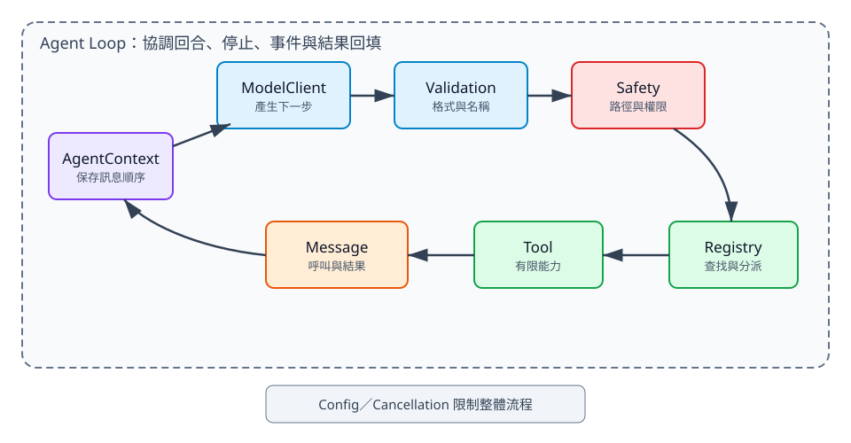

# 2. 把 Agent Loop 拆成七個模組

## 本章目標

本章把看似神奇的 Agent 拆成七種可替換責任：訊息、Context、模型、工具、Registry、驗證與安全、控制流程。讀完後，你應能判斷一段新功能該放在哪裡，而不是把所有邏輯塞進 Agent Loop。

## 為什麼一個巨大 Agent 類別會失控

初版原型常把 prompt、HTTP、工具、檔案操作、重試與終端機輸出寫在同一個函式。短期看似方便，幾次修改後就會出現三個問題：

1. 測試模型時意外執行檔案工具。
2. 更換模型供應商時必須重寫核心 Loop。
3. 權限與錯誤處理散落在多條分支，難以證明每條路徑都安全。

拆分不是為了增加檔案，而是降低替換成本，並讓失敗可以被定位。

## 七個模組與單一責任

| 模組 | 只負責什麼 | 不應負責什麼 | 代表 API |
|---|---|---|---|
| Message | 表示使用者、assistant、工具呼叫與結果 | 呼叫模型或執行工具 | `UserMessage`、`ToolCall` |
| Context | 保存目前推理需要的訊息順序 | 決定下一個工具 | `AgentContext` |
| ModelClient | 根據 Context 產生下一個 assistant message | 直接修改 Workspace | `complete()` |
| Tool | 執行一項有限能力 | 決定整個 Agent 流程 | `execute()` |
| Registry | 依名稱查找與分派工具 | 解讀每個工具的業務欄位 | `register()`、`execute()` |
| Validation／Safety | 檢查格式、路徑、權限與政策 | 生成模型回答 | `validate_tool_call()`、Hook |
| Agent Loop | 協調模型、工具、停止與結果回填 | 知道供應商 SDK 細節 | `run_agent_loop()` |

## 資料如何穿過七個模組



文字摘要：Agent Loop 從 Context 呼叫 ModelClient。assistant 若提出 ToolCall，先經 Validation 與 Safety，再交給 Registry 找到具體 Tool。ToolResultMessage 回到 Context，形成下一回合的輸入。Config 與取消訊號則限制整個流程。

這個架構有兩個重要方向：資料沿著 Loop 前進，政策在工具執行前攔截。不要讓工具繞過 Validation，也不要讓 UI 直接修改 Context 內部狀態。

## 用替換實驗理解模組化

假設目前使用 `FakeModel` 與 Calculator。接著想加入真正模型與 ReadTool：

- 替換 `FakeModel`：只新增一個 `ModelClient` Adapter。
- 加入 Read：建立 `ReadTool` 並註冊到 Registry。
- 限制檔案位置：放在 Workspace 與 ReadTool，不放進 prompt。
- 要求使用者核准 Write：放在執行前 Safety Hook。
- 顯示「工具執行中」：訂閱事件，不修改工具內容。

若新增一個功能時必須同時修改四、五個模組，通常代表責任邊界還不夠清楚。

## 失敗應該在哪一層被看見

同一個「讀檔失敗」可能有不同來源：

| 問題 | 最先發現的層級 | 例子 |
|---|---|---|
| 工具名稱不存在 | Validation／Registry | `name="reader"` 但只有 `read` |
| arguments 不是物件 | Validation | 模型回傳字串而非 dict |
| 路徑越界 | Workspace／ReadTool | `../../secret.txt` |
| 權限政策拒絕 | Safety Hook | 未核准讀敏感檔案 |
| 檔案不存在 | ReadTool | Workspace 內沒有該路徑 |
| 模型重複呼叫 | Agent Loop／Config | 超過 `max_turns` |

把錯誤放在最接近原因的層級，訊息會更準確，測試也更小。

## Config 與依賴注入

`AgentConfig` 保存最大回合數、工具逾時與循序／平行模式。這些值影響控制流程，卻不是某一個工具的責任。Registry、Config、Hook 與 CancellationToken 都由呼叫端傳入，讓測試可以替換成最小版本。

```python
config = AgentConfig(
    max_turns=4,
    tool_timeout_seconds=3.0,
    tool_execution="sequential",
)
```

這段設定可編譯，但完整使用時仍需從 `mini_agent.config` 匯入 `AgentConfig`。本書會在第 5 章處理設定與依賴注入。

## 本章檢查清單

- [ ] 每個模組有一句能說清楚的責任。
- [ ] 模型 Adapter 不直接操作 Workspace。
- [ ] 工具不控制最大回合數。
- [ ] Safety 在工具執行前，而不是事後才記錄。
- [ ] UI 透過事件觀測，不侵入核心 Loop。

## 練習

1. 指出哪個模組可以知道 API Key，並說明為何其他模組不需要知道。
2. 為「列出 Workspace 檔案」標出 Message、Tool、Registry、Validation 各自的工作。
3. 把 `max_turns` 寫死在 Tool 的設計改成 Config 注入，列出測試會變簡單的地方。

## 本章驗收

- 能畫出七個模組與單向資料流。
- 能為常見錯誤指出最先負責攔截的層級。
- 能在加入新工具時不修改核心 Agent Loop。
- 能說明依賴注入如何讓 FakeModel 測試不需要網路。
