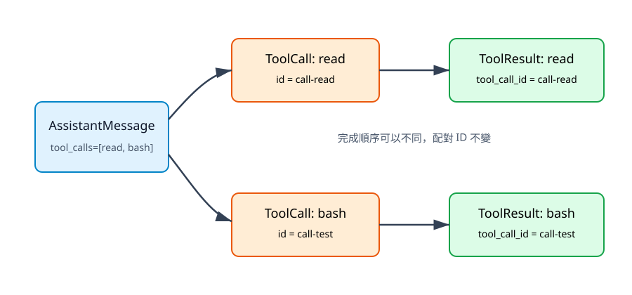

# 3. 用 Python 表示對話訊息

## 本章目標

本章建立 `UserMessage`、`AssistantMessage`、`ToolResultMessage` 與 `ToolCall`，讓對話不再是散落字串。你會看見工具呼叫與結果如何用 ID 配對，以及內部資料模型如何與模型供應商格式分離。

## 字串為什麼不夠

如果把所有內容串成一段文字，系統很快會遇到無法可靠回答的問題：

- 哪一段是使用者要求，哪一段是模型產生？
- 模型要求的是工具呼叫，還是只是提到工具名稱？
- 兩個平行工具結果分別對應哪個呼叫？
- 工具回傳的是正常資料還是錯誤？
- 哪些欄位可以送給供應商，哪些只是內部狀態？

明確資料型態讓這些問題在程式邊界就能檢查，而不是執行到一半才猜測。

## 四個核心資料型態

| 型態 | 角色 | 必要資訊 |
|---|---|---|
| `UserMessage` | 使用者輸入 | `content` |
| `AssistantMessage` | 模型回答或下一步決策 | `content`、`tool_calls`、`stop_reason` |
| `ToolCall` | 模型提出的工具請求 | `id`、`name`、`arguments` |
| `ToolResultMessage` | 工具執行結果 | `tool_call_id`、`tool_name`、`content`、`is_error` |

本專案使用 dataclass，讓測試可以直接建立訊息：

```python
from mini_agent.messages import ToolCall, UserMessage

message = UserMessage(content="讀取 README")
call = ToolCall(
    id="call-1",
    name="read",
    arguments={"path": "README.md"},
)
```

`arguments` 必須是物件型資料，而不是「請讀 README」這種待解析文字。模型提出結構化意圖，Validation 與 Tool 再分別檢查通用格式與具體欄位。

## ToolCall 與 ToolResult 如何配對



文字摘要：assistant 可以同時提出 `call-read` 與 `call-test`。Read 與 Bash 的完成先後可能不同，但每個 ToolResultMessage 都帶回原始 `tool_call_id`，因此 Context 能保存穩定配對，不需要用列表位置猜測。

唯一 ID 是平行執行的必要條件，也是事件系統追蹤工具生命週期的依據。工具名稱仍會保留，方便記錄與除錯，但配對應以 ID 為主。

## 正常結果與錯誤結果使用同一條回饋路徑

工具失敗不代表整個 Python 程式一定要立即終止。可恢復錯誤可以轉成 `ToolResultMessage(is_error=True)`，讓模型看見真實失敗並決定是否重新 Read、修改參數或停止。

```python
from mini_agent.messages import ToolResultMessage

result = ToolResultMessage(
    tool_call_id="call-1",
    tool_name="read",
    content="File not found: README-old.md",
    is_error=True,
)
```

這不表示所有錯誤都應交給模型。Workspace 越界、使用者取消或系統政策拒絕，仍應由程式碼強制控制；模型不能自行宣告繞過。

## `to_dict()` 是 Adapter 邊界

每種訊息提供 `to_dict()`，把內部資料轉成一般 Python dict。供應商 Adapter 可以再把它轉成特定 SDK 格式：

```python
payload = [
    UserMessage("計算 2 + 3").to_dict(),
    ToolResultMessage("call-1", "calculator", 5).to_dict(),
]
```

預期角色順序仍是 `user`、`tool`。核心測試只驗證本書自己的資料契約，不必匯入任何付費模型 SDK。

## 一個完整回合的訊息序列

```text
1. UserMessage("計算 2 + 3")
2. AssistantMessage(tool_calls=[ToolCall("call-1", "calculator", ...)])
3. ToolResultMessage(tool_call_id="call-1", content=5)
4. AssistantMessage("計算結果是 5。")
```

順序不能任意刪改。若保留 ToolResult 卻刪掉對應 ToolCall，某些供應商會拒絕請求；若只保留 ToolCall 沒有結果，模型也可能以為工具仍在執行。

## 常見設計錯誤

1. 用 assistant 文字中的工具名稱判斷是否執行。
2. 以列表第 N 個位置配對平行工具結果。
3. 把例外字串偽裝成正常結果，沒有 `is_error`。
4. 讓供應商 SDK 類別滲入 Tool 與 AgentContext。
5. 在截斷的 assistant 輸出中仍執行不完整 ToolCall。

## 本章檢查清單

- [ ] 每個訊息都有明確 role。
- [ ] ToolCall ID 非空且在結果中原樣帶回。
- [ ] arguments 是 dict，工具再檢查具體欄位。
- [ ] 錯誤結果可以和正常結果區分。
- [ ] 供應商格式只存在 Adapter 邊界。

## 練習

1. 新增一個 `SystemMessage`，說明它是否應進入公開 `Message` Union。
2. 為空工具 ID 與非 dict arguments 加入失敗測試。
3. 建立兩個 ToolCall 與反向完成的結果，證明配對不依賴位置。

## 本章驗收

- `tests/test_messages.py` 通過。
- 能說明 assistant message 與 tool result message 的責任差異。
- 能畫出 ToolCall ID 與 ToolResult ID 的配對。
- 能解釋為什麼內部訊息模型不應綁定供應商 SDK。
