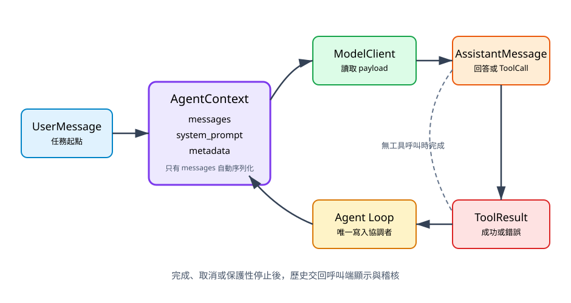

# 4. 建立 Agent Context

## 本章目標

本章把 Context 定義為「模型下一次決策所需的受控狀態」，而不是永遠增長的聊天紀錄。你會學會保存訊息順序、複製 Context、轉成模型 payload，並分辨哪些資訊可以送給模型、哪些只應留在本機控制層。

## Context 解決什麼問題

模型 API 通常是無狀態的。每次呼叫 `complete()` 時，系統必須重新提供模型需要的訊息。如果 Agent 剛執行 Read，下一次模型呼叫卻沒有收到 ToolResult，它就不知道檔案內容，也無法根據真實結果繼續。

Context 因此承擔三件事：

1. 保存訊息的因果順序。
2. 為下一次模型呼叫產生穩定 payload。
3. 保存 Loop 需要、但不一定要交給模型的本機 metadata。

Context 不負責選工具，也不負責修改 Workspace。它是狀態容器，不是第二個 Agent Loop。

## 最小資料模型

目前 `AgentContext` 有三個欄位：

```python
from mini_agent.context import AgentContext
from mini_agent.messages import UserMessage

context = AgentContext(
    messages=[UserMessage("讀取 README")],
    system_prompt="你是受限的 Python Coding Agent。",
    metadata={"workspace": "/project"},
)
payload = context.convert_to_llm()
```

| 欄位 | 用途 | 目前是否由 `convert_to_llm()` 送出 |
|---|---|---|
| `messages` | 使用者、assistant、工具呼叫與結果 | 是 |
| `system_prompt` | 核心行為與角色說明 | 否，留給 Adapter 決定如何加入 |
| `metadata` | Workspace、追蹤 ID、本機政策資訊 | 否 |

這個差異很重要。metadata 可能包含絕對路徑、內部識別碼或不應送給外部模型的資料，不能因為它位於 Context 就自動序列化。

## Context 生命週期



文字摘要：Context 先保存 UserMessage。ModelClient 讀取它並產生 AssistantMessage；若有 ToolCall，Loop 執行工具並附加 ToolResultMessage。下一次 ModelClient 讀到更新後的 Context。完成、取消或保護性停止後，呼叫端取得完整歷史進行顯示與稽核。

這個流程有一位寫入協調者：Agent Loop。ModelClient 讀取 Context；工具回傳結果；Loop 負責把 assistant 與 tool result 依正確順序放入 messages。若工具自行修改 Context，平行工具就可能產生不可預測順序。

## `convert_to_llm()` 的穩定邊界

目前實作很小：逐一呼叫訊息的 `to_dict()`。

```python
payload = context.convert_to_llm()
roles = [item["role"] for item in payload]
```

當 Context 依序包含 User、Assistant、ToolResult 時，`roles` 應保持 `user`、`assistant`、`tool`。Adapter 可以把這些 dict 轉成特定供應商格式，但不應改變 ToolCall 與 ToolResult 的配對關係。

若日後供應商要求 system message，應在 Adapter 或明確的 Context 轉換策略中加入，並增加測試；不要暗中把 `system_prompt` 拼到第一個 user message。

## `copy()` 不是完整隔離

`AgentContext.copy()` 會建立新的 messages list 與 metadata dict：

```python
branch = context.copy()
branch.messages.append(UserMessage("只加入分支"))
```

加入新訊息不會改變原本 list；新增 metadata key 也不會回寫原本 dict。但這仍是淺拷貝：若 metadata value 本身是可變 list 或 dict，兩份 Context 仍可能共享內層物件。

在一般 Loop 中，淺拷貝足以建立暫時分支；若要隔離巢狀 metadata，應限制 metadata value 為不可變資料，或明確建立深拷貝策略與成本測試。

## Context 不是完整聊天紀錄

短範例可以保存所有訊息，長時間 Agent 卻會受到 Context window、成本與敏感資料風險限制。管理策略應回答：

- 哪些訊息是目前決策的必要證據？
- 哪些舊內容可以摘要？
- 哪些工具輸出太大，應只保存節錄與檔案位置？
- 哪些秘密根本不該進入模型 Context？
- ToolCall 與 ToolResult 是否仍完整配對？

安全的壓縮順序通常是：先限制單次工具輸出，再摘要較舊的自然語言，最後才淘汰可重新取得的內容。不要直接刪掉最近錯誤或尚未配對的工具訊息。

## 一個可測量的初版預算

第 17 章會深入 Context 預算。現階段先用兩個容易測試的上限：訊息數量與字元數。超過上限時先停止新增大型輸出或要求摘要，而不是讓 Context 無限制成長。

```python
def context_size(context):
    message_count = len(context.messages)
    character_count = sum(len(str(item.to_dict())) for item in context.messages)
    return message_count, character_count
```

這不是精準 token 數，但可以作為供應商無關的保護性指標。

## 敏感資料邊界

system prompt、metadata 與 ToolResult 都可能包含敏感內容。最低原則是：

1. API Key 由 Adapter 或環境取得，不放進 messages。
2. Workspace 絕對路徑若無必要，不送給模型。
3. Bash 的完整環境變數不應成為工具結果。
4. 大型檔案先限制讀取範圍，再加入 Context。
5. 記錄除錯資訊時，先遮蔽秘密與憑證。

## 本章檢查清單

- [ ] Context 中的訊息順序能重建每次決策依據。
- [ ] `system_prompt` 與 metadata 不會意外混入模型 payload。
- [ ] 工具只回傳結果，由 Loop 寫入 Context。
- [ ] 複製 Context 時理解淺拷貝限制。
- [ ] Context 成長有可測量上限與停止策略。

## 練習

1. 使用 metadata 記錄 Workspace 標籤，不存放 API Key，並證明 `convert_to_llm()` 不會送出 metadata。
2. 為 `copy()` 寫測試：分支新增訊息不影響原本 Context，再測試巢狀 metadata 的共享行為。
3. 實作一個只計算訊息數與字元數的 Context 預算函式，超過預算時回傳明確狀態。

## 本章驗收

- 能把訊息轉成角色順序穩定的 payload。
- 能說明 messages、system prompt、metadata 的不同外洩風險。
- 能區分執行歷史與下一回合必要 Context。
- 不讓 Tool 或供應商 SDK 直接控制 Context 內部狀態。
