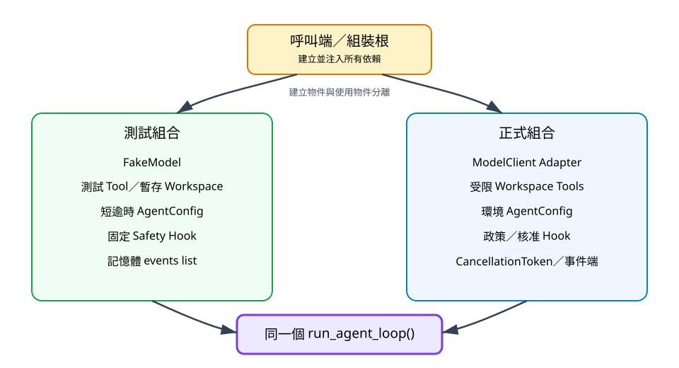

# 5. 設定、Callback 與依賴注入

## 本章目標

本章把最大回合數、工具逾時、循序／平行模式與安全 Hook 放進可測試的設定與依賴。你會學會避免全域狀態、確認 Hook 的執行位置，並用同一個 Agent Loop 組合測試版與正式版元件。

## 為什麼全域設定會傷害測試

如果 `MAX_TURNS`、Workspace 或模型 client 藏在模組全域變數中，測試會互相影響：一個測試把逾時改成 0.01 秒，另一個測試可能在同一個 Python process 讀到修改後的值。更麻煩的是，匯入模組時就建立網路 client 或讀取環境，會讓單元測試依賴外部服務。

本書改用呼叫端組裝：建立 Model、Context、Registry、Config、Hook、事件收集器與 CancellationToken，再傳給 `run_agent_loop()`。

## `AgentConfig` 的三個控制項

`AgentConfig` 是不可變 dataclass：

```python
from mini_agent.config import AgentConfig

config = AgentConfig(
    max_turns=4,
    tool_timeout_seconds=2.0,
    tool_execution="sequential",
)
```

| 設定 | 控制什麼 | 錯誤值 |
|---|---|---|
| `max_turns` | 模型與工具最多往返幾回合 | 小於 1 |
| `tool_timeout_seconds` | 每次工具執行最長時間 | 小於或等於 0 |
| `tool_execution` | 同回合工具循序或平行執行 | 非 `sequential`／`parallel` |

不可變不代表不能使用不同設定；它表示建立後不會被其他程式悄悄修改。每個測試直接建立自己的 Config。

## 設定值是安全界線

三個欄位不只是效能調整：

- `max_turns` 防止模型重複要求同一工具形成無限迴圈。
- `tool_timeout_seconds` 限制卡住的 Shell 或 I/O。
- `tool_execution` 防止有資料相依的 Write／Edit 被錯誤平行化。

安全預設應偏向可觀察、可停止。讀者尚未證明工具彼此獨立前，先使用 sequential。

## Hook 位於哪裡

`before_tool_call` 的順序是：

```text
模型提出 ToolCall
→ 通用參數驗證
→ before_tool_call
→ 取消檢查
→ tool_start 事件
→ 工具執行與逾時
→ tool_end 事件
```

這個位置讓 Hook 可以在副作用發生前做 approval 或政策判斷。它不能修復格式錯誤的 ToolCall，因為通用 Validation 已先執行；它也不應直接執行工具，否則事件、逾時與結果回填會被繞過。

同步 Hook 範例：

```python
def allow_read_only(_call_id, name, _arguments):
    return name == "read"
```

非同步 Hook 可以詢問外部核准系統：

```python
async def require_approval(_call_id, name, _arguments):
    if name == "read":
        return True
    return await approval_service.approve(name)
```

第二段是介面示意；`approval_service` 由呼叫端注入，不能在 Hook 內偷偷建立全域連線。

## 拒絕也是 ToolResult

目前 Loop 會把 Hook 拒絕轉成 `ToolResultMessage(is_error=True)`，工具本身不會被呼叫。這讓模型可以得知「政策拒絕」，再改用較低風險工具或停止。

測試要驗證兩件事，而不只看最後回答：

1. Tool 的 `execute()` 確實沒有執行。
2. Context 收到可辨識的錯誤結果。

```python
blocked = before_tool_call("call-1", "bash", {"command": "rm -rf ."})
assert blocked is False
```

Hook 不是唯一安全層。Workspace 邊界、工具 allowlist 與參數驗證仍需由程式碼獨立強制執行。

## 依賴注入如何形成兩套組合



文字摘要：呼叫端是組裝根。測試時注入 FakeModel、測試 Tool、短逾時、記憶體事件 list 與固定 Hook；正式執行時可替換成模型 Adapter、Workspace Tools、政策 Hook 與 CancellationToken。兩者共用同一個 `run_agent_loop()`，因此核心流程只測一次。

依賴注入不是一定要引入框架。Python 函式參數就能完成最重要的工作：把「建立物件」與「使用物件」分開。

## 組裝根範例

以下片段呈現呼叫端如何組合依賴：

```python
from mini_agent.config import AgentConfig
from mini_agent.context import AgentContext
from mini_agent.tools import CalculatorTool, ToolRegistry

context = AgentContext()
tools = ToolRegistry([CalculatorTool()])
config = AgentConfig(max_turns=3, tool_timeout_seconds=1.0)
```

ModelClient 與 UserMessage 會由實際入口補上。重點是 Tool 不讀取全域 Config，Agent Loop 也不自行建立 Tool。

## 常見失敗設計

1. 在 import 時建立真實模型 client，導致測試需要金鑰。
2. Hook 只記錄危險操作，卻永遠回傳 True。
3. 使用平行模式執行同一檔案的 Write 與 Edit。
4. 工具自行設定無限逾時，繞過 Config。
5. 測試只檢查 assistant 最後說「已阻擋」，沒有證明工具未執行。
6. 把 Config 做成可變 singleton，讓測試順序影響結果。

## 本章檢查清單

- [ ] 每次 Agent 執行都有明確 Config。
- [ ] Hook 位於工具副作用前，拒絕時工具沒有執行。
- [ ] 測試使用 FakeModel 與獨立依賴，不需要網路。
- [ ] 平行模式只用於互不相依工具。
- [ ] 呼叫端負責組裝，核心 Loop 不讀全域秘密。

## 練習

1. 寫一個只允許 Read、不允許 Bash 的同步 Hook，驗證被拒工具的 `called` 仍為 False。
2. 寫一個非同步 Hook，模擬 10 毫秒核准延遲，確認 Loop 能正確 await。
3. 為 `max_turns=0`、逾時為 0、未知執行模式加入失敗測試。

## 本章驗收

- 能建立不依賴全域狀態的 Agent 組合。
- 能說出 Validation、Hook、取消、事件與工具的正確順序。
- 能在測試中替換模型、工具、設定與安全政策。
- 能以「工具未被執行」證明 Safety Hook 真正生效。
