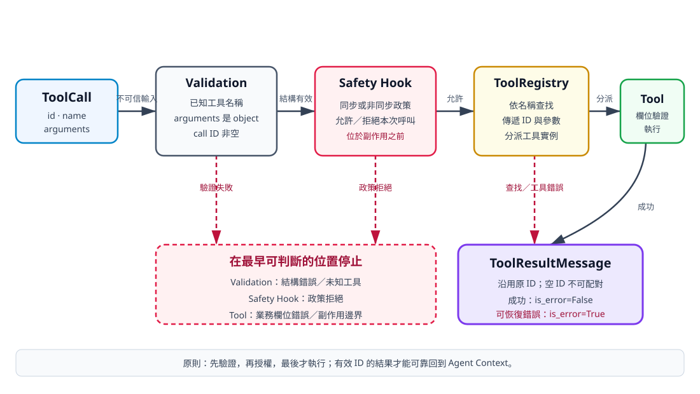

# 8. 驗證模型產生的工具參數

## 本章目標

把工具呼叫放進完整的執行前管線。讀完本章後，你應能：

- 把模型產生的 `ToolCall` 視為不可信輸入；
- 說明 Validation、Safety Hook、Registry 與具體 Tool 的責任；
- 驗證工具名稱、arguments 外形與 call ID；
- 確認安全政策在工具副作用之前執行；
- 分辨可回填給模型的錯誤與應直接終止的取消；
- 使用 `ToolResultMessage(is_error=True)` 保留可稽核結果。

本章不導入完整 JSON Schema。目標是先守住所有工具都共用的最小不變條件，再讓每個工具處理自己的欄位規則。

## 不可信的不是只有使用者

模型供應商可能提供結構化工具呼叫，但「結構化」不代表內容必然有效。程式仍可能收到：

- 尚未註冊的工具名稱；
- 空白或缺失的 call ID；
- 不是 JSON object 的 arguments；
- object 內缺少必要欄位；
- 欄位型態錯誤；
- 結構正確但不符合目前使用者權限的操作。

型別註記也不是執行期防線。雖然 `ToolCall.arguments` 註記為 `dict[str, Any]`，Python 執行時仍可能由 Adapter 或測試建立出包含 list 的物件。外部資料跨進核心程式時，仍須做執行期驗證。

## 三層檢查，不要塞進同一個函式

工具呼叫從模型走到副作用之前，依序經過三類判斷：

1. **Validation：** 呼叫外形是否符合所有工具共用的契約？
2. **Safety Hook：** 這次呼叫在目前政策與使用者情境下是否允許？
3. **具體 Tool：** 參數是否符合該工具的業務規則，並實際執行？

Registry 位於 Tool 前方，依通過檢查的名稱查找實例。完整方向如下：

```text
ToolCall
→ validate_tool_call()
→ before_tool_call Safety Hook
→ ToolRegistry.execute()
→ AgentTool.execute()
→ ToolResultMessage
```



文字摘要：Validation 先拒絕結構不完整或未知的呼叫，因此 Safety Hook 與工具看不到這些輸入。Safety Hook 在任何工具副作用之前決定允許或拒絕。通過後，Registry 才依名稱分派到 Calculator 等具體工具。只要原始 call ID 有效，成功與可恢復錯誤都能保留 ID 回到 Context。空 ID 雖會被偵測並阻止工具執行，但目前最小實作產生的錯誤結果仍是空 ID，模型端不能可靠配對。

## 最小 Validation 實作

`src/mini_agent/validation.py` 定義專用錯誤與驗證函式：

```python
from mini_agent.messages import ToolCall


class ToolValidationError(ValueError):
    pass


def validate_tool_call(call: ToolCall, known_tools: set[str]) -> None:
    if call.name not in known_tools:
        raise ToolValidationError(f"Unknown tool: {call.name}")
    if not isinstance(call.arguments, dict):
        raise ToolValidationError("Tool arguments must be an object")
    if not call.id.strip():
        raise ToolValidationError("Tool call id is required")
```

這一層只檢查三個共通不變條件：

| 檢查 | 防止的問題 | 不處理的細節 |
|---|---|---|
| 名稱存在於 `known_tools` | 模型要求未提供的能力 | 工具名稱的供應商格式限制 |
| arguments 是 dict | list、字串或其他外形直接進入工具 | Calculator 欄位是否齊全 |
| ID 非空 | ToolResult 無法與 ToolCall 配對 | ID 是否符合特定供應商格式 |

目前函式依「名稱、arguments、ID」順序檢查。若同一呼叫同時有多個問題，只會先看到第一個錯誤；呼叫端不應依賴一次回報所有缺陷。

## 三種 Validation 失敗

### 未知工具

```python
from mini_agent.messages import ToolCall
from mini_agent.validation import validate_tool_call

validate_tool_call(
    ToolCall("call-1", "delete_everything", {}),
    {"calculator", "read"},
)
```

預期例外：

```text
ToolValidationError: Unknown tool: delete_everything
```

### arguments 不是 object

以下程式刻意跨過型別註記，模擬外部 Adapter 傳入錯誤資料：

```python
validate_tool_call(
    ToolCall("call-2", "read", []),
    {"read"},
)
```

預期例外：

```text
ToolValidationError: Tool arguments must be an object
```

### call ID 為空

```python
validate_tool_call(
    ToolCall("", "calculator", {"operation": "add", "left": 1, "right": 2}),
    {"calculator"},
)
```

預期例外：

```text
ToolValidationError: Tool call id is required
```

ID 不是裝飾欄位。若一個模型回應同時要求多個工具，結果可能以不同時間完成；沒有穩定 ID 就無法可靠配對請求與結果。

目前 `run_agent_loop()` 會捕捉這個 Validation 錯誤，並以原本的空字串建立 `ToolResultMessage`。這能留下「工具未執行」的稽核紀錄，卻不能建立可靠配對。正式供應商 Adapter 應在資料進入 Agent Loop 前拒絕缺少 ID 的回應，或把它視為不可恢復的協定錯誤；不能替模型自行捏造一個看似有效的 ID。

## 為什麼 Validation 之後還要 Registry 檢查

Validation 使用 `tools.names()` 取得目前已知名稱；Registry 的 `get()` 仍會在查找失敗時拋出 `KeyError`。兩者看似重複，實際上保護不同介面：

- Validation 為完整 Agent 管線提供一致、可回填的輸入錯誤；
- Registry 也可以被其他 Python 呼叫端直接使用，因此不能假設所有呼叫者都先做過 Validation。

這是邊界防禦，不代表每一層都要重複所有檢查。Registry 不驗證 Calculator 的數字，Validation 也不執行名稱分派。

## Safety Hook 必須位於副作用之前

結構正確的呼叫仍可能不被允許。例如 `write` 參數可能完整、路徑也在 Workspace 內，但目前工作階段只允許讀取。這類決策屬於政策，不屬於 Schema。

Agent Loop 接受同步或非同步 `before_tool_call`：

```python
async def execute_after_policy(call):
    validate_tool_call(call, tools.names())

    if before_tool_call:
        allowed = before_tool_call(call.id, call.name, call.arguments)
        if inspect.isawaitable(allowed):
            allowed = await allowed
        if not allowed:
            raise PermissionError("Tool call blocked by safety hook")

    return await tools.execute(call.id, call.name, call.arguments)
```

順序不能顛倒。若先呼叫 `tools.execute()`，即使 Hook 之後回傳 `False`，檔案或子行程可能早已被修改。

以下測試使用會記錄呼叫狀態的工具，確認拒絕時工具沒有執行：

```python
class Tool:
    name = "danger"
    description = "Test that blocked tools never execute."
    called = False

    async def execute(self, tool_call_id, arguments):
        self.called = True
        return "should not happen"


tool = Tool()
# run_agent_loop(..., before_tool_call=lambda _id, _name, _args: False)
assert tool.called is False
```

真正的政策 Hook 可以檢查工具名稱、arguments、使用者核准狀態或環境規則，但不應把密碼、API Key 等秘密交給模型決定。

## 具體工具仍須驗證業務欄位

Validation 只確認 arguments 是 dict，不知道每個 dict 需要哪些鍵。以下呼叫可通過共通 Validation：

```python
ToolCall(
    "call-4",
    "calculator",
    {"operation": "add", "left": "2", "right": 3},
)
```

但 Calculator 會拒絕字串 `left`。同樣地，Read Tool 應檢查路徑欄位並強制 Workspace 邊界；Bash Tool 應檢查命令允許清單與逾時。把這些規則留在具體工具，才能讓每個工具獨立測試。

## 把可恢復錯誤回填給模型

Agent Loop 在單次工具執行周圍捕捉一般 `Exception`，並轉成錯誤結果：

```python
async def execute_with_error_result(call):
    try:
        validate_tool_call(call, tools.names())
        # Safety Hook、取消檢查與工具執行
        result = await tools.execute(call.id, call.name, call.arguments)
        return ToolResultMessage(call.id, call.name, result)
    except Exception as exc:
        return ToolResultMessage(call.id, call.name, str(exc), True)
```

因此 Validation、Safety Hook 或具體工具的一般錯誤會形成：

```python
ToolResultMessage(
    tool_call_id="call-4",
    tool_name="calculator",
    content="left and right must be numbers",
    is_error=True,
)
```

模型下一回合可以看到錯誤並修正參數。這不保證模型一定能修正，因此仍須搭配 `max_turns`，避免無限重試。

### 不是所有失敗都應假裝可恢復

本專案的合作式取消使用繼承自 `asyncio.CancelledError` 的 `AgentCancelled`。取消代表呼叫端要求停止，不是模型應修正的工具參數，因此會離開一般 `Exception` 錯誤回填路徑並終止 Agent。工具逾時、事件收尾與取消細節會在第 16 章完整說明。

## 錯誤分類表

| 發現位置 | 例子 | 工具是否執行 | 目前結果 |
|---|---|---:|---|
| Validation | 未知名稱、arguments 非 object，且 ID 有效 | 否 | 可配對的 `ToolResultMessage(is_error=True)` |
| Validation | 空 ID 或只有空白字元的 ID | 否 | 錯誤結果沿用無效 ID；可稽核但不可可靠配對 |
| Safety Hook | 政策拒絕本次呼叫 | 否 | `ToolResultMessage(is_error=True)` |
| 具體 Tool | Calculator 型態錯誤、Workspace 越界 | 已進入工具，但應在副作用前拒絕 | `ToolResultMessage(is_error=True)` |
| 逾時 | 工具超過設定秒數 | 可能已開始 | 錯誤結果；工具需支援安全停止 |
| 主動取消 | 操作者要求停止 | 不再啟動下一項工作 | `AgentCancelled` 終止流程 |
| 最大回合數 | 模型持續要求工具 | 視先前回合而定 | `RuntimeError` 終止流程 |

「已進入工具」不等於副作用必然已發生。設計良好的工具會先完成欄位、路徑與政策相關檢查，再修改外部狀態。

## 執行驗證

先執行 Validation 單元測試：

```bash
uv run --extra test pytest tests/test_validation.py -q
```

再驗證 Safety Hook 確實能在工具前阻擋：

```bash
uv run --extra test pytest \
  tests/test_agent_controls.py::test_sync_safety_hook_can_block_tool \
  -q
```

最後執行完整驗證入口：

```bash
uv run --extra test python scripts/verify_all.py .
```

完成條件是三個命令都以結束碼 `0` 結束；執行時間只作參考，不是驗收標準。

## 檢查清單

- [ ] 所有模型 ToolCall 都先視為不可信輸入。
- [ ] 未知工具在任何工具執行前被拒絕。
- [ ] arguments 必須是 object，call ID 必須非空。
- [ ] Safety Hook 在 Registry 與具體 Tool 之前執行。
- [ ] 具體工具仍驗證自己的欄位與副作用邊界。
- [ ] 具有有效 ID 的可恢復錯誤保留 call ID 並標記 `is_error=True`。
- [ ] 空 ID 與只有空白字元的 ID 會阻止工具執行，且不把無效 ID 誤報為可可靠配對。
- [ ] 最大回合數限制模型反覆修正的次數。
- [ ] 主動取消不會被誤包裝成普通工具錯誤。

## 練習

1. **基礎：補空 ID 測試。** 在 `tests/test_validation.py` 加入空 ID 案例，先確認測試能描述預期錯誤，再執行該測試檔。
2. **進階：證明執行順序。** 建立一個會記錄 `hook` 與 `tool` 的測試，確認允許時順序為 `hook, tool`，拒絕時只有 `hook`。
3. **挑戰：加入選配 Schema 層。** 為工具設計可選的參數 Schema，但不要讓核心強制依賴第三方套件。先定義 Schema 驗證失敗如何轉成 `ToolResultMessage`，並保持現有最小工具仍可註冊。

## 本章小結

結構化模型輸出仍是不可信輸入。Validation 守住所有工具共通的 ToolCall 外形，Safety Hook 判斷本次操作是否獲准，Registry 負責名稱分派，具體工具驗證業務欄位並執行。這條順序讓錯誤在最早可判斷的位置停止，也確保政策拒絕發生在副作用之前。

## 本章驗收

- `tests/test_validation.py` 與 Safety Hook 指定測試皆通過。
- 能實際觸發未知工具、arguments 非 object 與空 ID 三種錯誤。
- 能說明為什麼 Validation 與 Registry 都會防止未知工具。
- 能證明 Hook 拒絕時具體工具沒有執行。
- 能區分錯誤結果、主動取消與最大回合終止。
- 能依序說出 `Validation → Safety Hook → Registry → Tool → ToolResultMessage`。
