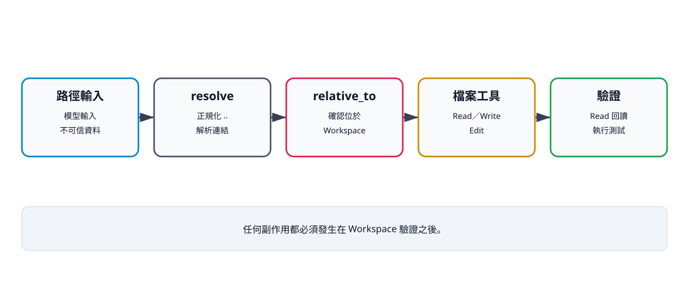

# 9. Read：安全讀取檔案

## 本章目標

建立第一個會接觸 Workspace 的 Coding 工具。讀完本章後，你應能：

- 解釋路徑慣例與實際 Workspace 包含關係檢查的差異；
- 使用 `Path.resolve()` 與 `relative_to()` 阻止解析後的位置逃逸；
- 以 UTF-8 讀取文字檔；
- 分辨不存在檔案、編碼錯誤與 Workspace 越界；
- 在讀取內容後以測試或再次檢查驗證結果。

## Workspace 是權限邊界

Read 看似沒有修改檔案，仍可能洩漏原始碼、憑證或設定。提示詞中的「只能讀專案」不能限制作業系統路徑；邊界必須由程式碼執行。

本書把所有檔案工具限制在一個明確的 Workspace 根目錄。教學與模型提示都以相對路徑為慣例，但目前函式沒有強制「輸入格式必須是相對路徑」；Workspace 內的絕對路徑也會通過。真正的判斷是解析後位置是否仍位於根目錄內。



文字摘要：Read、Write 與 Edit 共用同一條 Workspace 邊界。路徑先正規化並確認位於根目錄，副作用才可發生；修改後仍須讀回或執行測試，形成可驗證閉環。

```python
from pathlib import Path


class WorkspaceViolation(ValueError):
    pass


def ensure_workspace_path(workspace: Path, relative_path: str) -> Path:
    root = workspace.resolve()
    candidate = (root / relative_path).resolve()
    try:
        candidate.relative_to(root)
    except ValueError as exc:
        raise WorkspaceViolation(
            f"Path escapes workspace: {relative_path}"
        ) from exc
    return candidate
```

`resolve()` 會正規化 `..`，也會解析既有符號連結。`relative_to(root)` 成功才表示候選路徑位於根目錄之下。單純搜尋字串 `".."` 不夠，因為絕對路徑與符號連結也可能越界。這仍不是檔案沙箱：檢查與實際讀取之間存在 TOCTOU 競態，攻擊者若能同時替換符號連結，仍需更強的作業系統層控制。

## ReadTool 的完整實作

```python
from pathlib import Path

from mini_agent.safety import ensure_workspace_path


class ReadTool:
    name = "read"
    description = "Read a UTF-8 text file inside the workspace."

    def __init__(self, workspace: Path):
        self.workspace = workspace

    async def execute(self, tool_call_id: str, arguments: dict) -> str:
        path = ensure_workspace_path(self.workspace, arguments["path"])
        return path.read_text(encoding="utf-8")
```

Read 不解析 Python，也不執行檔案內容。它只接收路徑、套用 Workspace 邊界，再讀取 UTF-8 文字。

## 可執行範例

```python
import asyncio
import tempfile
from pathlib import Path

from mini_agent.tools.file_tools import ReadTool


async def main() -> None:
    with tempfile.TemporaryDirectory() as directory:
        workspace = Path(directory)
        (workspace / "src").mkdir()
        (workspace / "src/main.py").write_text(
            "print('hello, agent')\n", encoding="utf-8"
        )
        result = await ReadTool(workspace).execute(
            "read-1", {"path": "src/main.py"}
        )
        print(result, end="")


asyncio.run(main())
```

預期輸出：

```text
print('hello, agent')
```

## 三類失敗

| 失敗 | 來源 | 正確處理 |
|---|---|---|
| `WorkspaceViolation` | `../outside.txt`、Workspace 外絕對路徑或越界符號連結 | 停止，不嘗試猜測替代路徑 |
| 成功 | Workspace 內絕對路徑 | 目前會接受；相對路徑只是呼叫慣例 |
| `FileNotFoundError` | 路徑在 Workspace 內，但檔案不存在 | 回報模型，重新列出或確認路徑 |
| `UnicodeDecodeError` | 檔案不是 UTF-8 文字 | 明確回報不支援，不當成亂碼繼續 |

目前最小版本沒有讀取大小上限，也沒有行號範圍。大型檔案可能快速吃掉 Context，這是第 17 章要處理的預算問題。

## 驗證命令

```bash
uv run --extra test pytest tests/test_safety.py tests/test_tools.py -q
```

完成條件是測試結束碼為 `0`。測試至少證明 Workspace 子路徑可接受、父目錄逃逸被拒絕，以及檔案工具整合後仍只操作暫存 Workspace。

## 檢查清單

- [ ] 解析後位置必須在 Workspace 內，且不把「建議相對路徑」誤寫成已強制格式。
- [ ] 路徑在讀取前先解析與驗證。
- [ ] 使用明確 UTF-8 編碼。
- [ ] 不執行或匯入讀到的內容。
- [ ] 越界、檔案不存在與編碼錯誤可區分。
- [ ] 大型檔案限制列為後續必要控制。

## 練習

1. **基礎：不存在檔案。** 新增測試，確認 Workspace 內不存在的路徑產生 `FileNotFoundError`。
2. **進階：限制讀取量。** 先寫失敗測試，再加入 `max_bytes`，超過上限時不要載入全文。
3. **挑戰：行號範圍。** 設計 `start_line`、`limit`，明確定義超出檔案範圍與空檔案的結果。

## 本章小結

Read 的安全性不在於它「只讀」，而在於它只能讀取明確 Workspace 內的文字。路徑解析、編碼與大小限制都屬於工具契約，不能交給模型自行遵守。

## 本章驗收

- 能執行 Read 範例並得到預期內容。
- `../outside.txt` 在任何檔案讀取前被拒絕。
- 能說明 `resolve()` 與 `relative_to()` 各自負責什麼。
- 能指出目前沒有大小上限的限制與風險。
