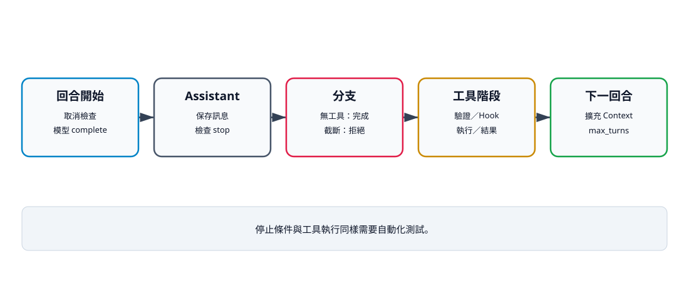

# 13. 第一個完整 Agent Loop

## 本章目標

把訊息、Context、ModelClient、Registry 與 ToolResult 串成可重複測試的控制迴圈。讀完本章後，你應能：

- 描述每個回合的資料流與停止條件；
- 使用 FakeModel 測試多回合工具呼叫；
- 在截斷時拒絕執行工具；
- 把可恢復工具錯誤放回 Context；
- 使用 `max_turns`、逾時與取消避免失控。

## Loop 管流程，不管工具細節

最小演算法如下：

```text
檢查取消
→ 呼叫模型
→ 保存 AssistantMessage
→ 若截斷且含 ToolCall：拒絕整批並停止
→ 若沒有 ToolCall：正常完成
→ 驗證、授權、執行工具
→ 保存 ToolResultMessage
→ 下一回合
→ 超過 max_turns：保護性停止
```

Loop 只依賴 `ModelClient` 與 `ToolRegistry`。Calculator、Read 或 Bash 的欄位規則留在工具內，供應商格式留在 Adapter。



文字摘要：每個回合都可能正常完成、因截斷拒絕工具、執行工具後進入下一回合，或因取消與最大回合停止。停止條件與工具成功路徑同樣需要測試。

## 完整函式的關鍵骨架

```python
async def run_agent_loop(model, context, tools, config):
    history = context.messages
    for _turn in range(config.max_turns):
        assistant = await model.complete(context)
        history.append(assistant)

        if assistant.stop_reason == "length" and assistant.tool_calls:
            for call in assistant.tool_calls:
                history.append(
                    ToolResultMessage(
                        call.id,
                        call.name,
                        "Model output was truncated; tool call was not executed.",
                        True,
                    )
                )
            return history

        if not assistant.tool_calls:
            return history

        results = []
        for call in assistant.tool_calls:
            validate_tool_call(call, tools.names())
            value = await tools.execute(call.id, call.name, call.arguments)
            results.append(ToolResultMessage(call.id, call.name, value))
        history.extend(results)

    raise RuntimeError(f"Agent reached maximum turns: {config.max_turns}")
```

這段省略 Hook、事件、逾時、平行與取消，目的是先看清楚回合閉環；正式 `run_agent_loop()` 已加入這些控制。

## FakeModel 的兩回合測試

```python
import asyncio

from mini_agent.agent_loop import run_agent_loop
from mini_agent.config import AgentConfig
from mini_agent.context import AgentContext
from mini_agent.messages import AssistantMessage, ToolCall, UserMessage
from mini_agent.model_client import FakeModel
from mini_agent.tools.base import ToolRegistry


class AddTool:
    name = "add"
    description = "Add two integers."

    async def execute(self, tool_call_id: str, arguments: dict) -> dict:
        return {"sum": arguments["a"] + arguments["b"]}


async def main() -> None:
    model = FakeModel([
        AssistantMessage("", [ToolCall("call-1", "add", {"a": 2, "b": 3})]),
        AssistantMessage("答案是 5。"),
    ])
    history = await run_agent_loop(
        model,
        AgentContext([UserMessage("2 加 3 是多少？")]),
        ToolRegistry([AddTool()]),
        AgentConfig(),
    )
    print(history[-2].content)
    print(history[-1].content)


asyncio.run(main())
```

預期輸出：

```text
{'sum': 5}
答案是 5。
```

`len(model.calls) == 2` 是閉環證據：模型先要求工具，工具結果進入 Context 後，模型才產生最終答案。

## 停止條件

| 條件 | 行為 | 是否再呼叫工具 |
|---|---|---:|
| 無 ToolCall | 正常回傳 history | 否 |
| 截斷且含 ToolCall | 加入錯誤結果並停止 | 否 |
| 主動取消 | 拋出 `AgentCancelled` | 否 |
| 工具逾時／一般錯誤 | 錯誤結果回填，模型可修正 | 該次已停止 |
| 達到最大回合 | `RuntimeError` | 不再開始新回合 |

截斷輸出尤其不能執行。即使 JSON 看起來可解析，尾端缺失仍可能改變原意或漏掉安全欄位。目前特殊拒絕只處理 `stop_reason == "length"` 且同時存在 ToolCall；若 length 沒有工具呼叫，Loop 會依「無工具」路徑回傳。

`max_turns` 計算的是模型 `complete()` 次數，不是工具數。在最後允許回合中產生的工具結果仍會加入 Context，之後迴圈才拋出 `RuntimeError`。ModelClient 自己的例外不在工具 wrapper 內，會直接向呼叫端傳遞。

## 錯誤回填與上限

一般工具例外會轉成 `ToolResultMessage(is_error=True)`。模型可以修正路徑或參數，但修正次數受 `max_turns` 限制。沒有上限的「自動修正」就是另一種無限迴圈。

## 驗證命令

```bash
uv run --extra test pytest tests/test_agent_loop.py tests/test_agent_controls.py -q
```

## 檢查清單

- [ ] AssistantMessage 先保存，再判斷下一步。
- [ ] 無工具呼叫時正常完成。
- [ ] 截斷工具呼叫永不執行。
- [ ] ToolCall 與 ToolResult 使用相同 ID。
- [ ] 可恢復錯誤有 `is_error=True`。
- [ ] 最大回合、逾時與取消都有測試。

## 練習

1. **基礎：最大回合。** 設 `max_turns=1`，用 FakeModel 持續要求工具，確認 `RuntimeError`。
2. **進階：錯誤恢復。** 工具先失敗，再讓 FakeModel 回覆修正結果，確認 history 保留錯誤。
3. **挑戰：回合事件。** 加入 `turn_start`、`turn_end`，定義正常、截斷與取消時的收尾。

## 本章小結

Agent Loop 的核心工作是控制：何時呼叫模型、何時執行工具、何時保存結果，以及何時停止。把這些條件寫成可測試分支，比把所有功能塞進一個「智慧 Agent」類別更可靠。

## 本章驗收

- 兩回合範例能輸出工具結果與最終答案。
- 正常完成、截斷、錯誤、取消與最大回合語意可區分。
- `tests/test_agent_loop.py` 與控制測試通過。
