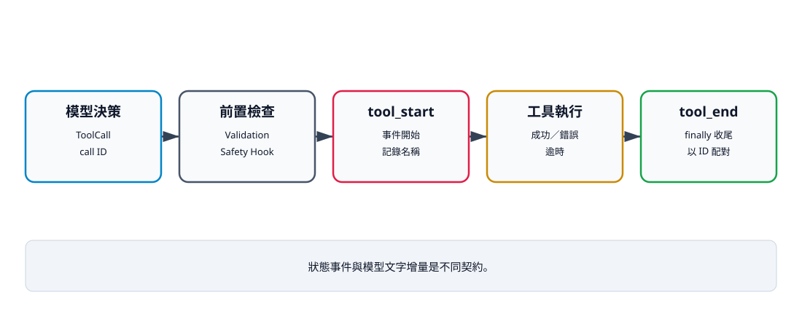

# 14. 串流輸出與事件系統

## 本章目標

建立核心 Loop 與外部介面之間的觀測邊界。讀完本章後，你應能：

- 使用 `AgentEvent` 表示工具生命週期；
- 以 call ID 配對開始與結束；
- 說明狀態事件與模型文字串流的差異；
- 確保工具失敗時仍產生收尾事件；
- 指出目前 list collector 並不是完整串流 API。

## UI 不應猜測核心狀態

終端機、Web UI 或日誌系統若直接讀取 Loop 內部變數，就會與實作細節綁死。事件提供穩定邊界：核心只描述「發生了什麼」，消費端自行決定如何顯示。

```python
from dataclasses import dataclass
from typing import Any


@dataclass(frozen=True)
class AgentEvent:
    type: str
    data: dict[str, Any]
```

目前原型只正式產生 `tool_start` 與 `tool_end`。它沒有 token delta、背壓、持久化或訂閱 API，因此應稱為事件收集器，不是完整串流系統。

## 正常與失敗時間軸

```text
正常：model → tool_start(id) → tool → tool_end(id) → model
失敗：model → tool_start(id) → error → tool_end(id) → model 修正
```

收尾放在 `finally`：



文字摘要：事件消費端不讀取 Loop 內部狀態，而是依 type、工具名稱與 call ID 顯示生命週期。工具失敗仍須收尾；模型文字增量則是另一種串流契約。

```python
async def execute_with_events(call, events, tools):
    try:
        events.append(
            AgentEvent("tool_start", {"id": call.id, "name": call.name})
        )
        return await tools.execute(call.id, call.name, call.arguments)
    finally:
        events.append(
            AgentEvent("tool_end", {"id": call.id, "name": call.name})
        )
```

正式 Loop 的 `tool_start` 位於 Validation、Safety Hook 與取消檢查之後；被這些前置檢查拒絕的呼叫目前仍會在 `finally` 產生 `tool_end`，但沒有對應 `tool_start`。消費端不應假設所有 end 都有 start；這也是事件契約後續需要修正或明確分類的限制。

## 最小消費端

```python
from mini_agent.events import AgentEvent


def render_event(event: AgentEvent) -> str | None:
    if event.type == "tool_start":
        return f"開始：{event.data['name']} ({event.data['id']})"
    if event.type == "tool_end":
        return f"結束：{event.data['name']} ({event.data['id']})"
    return None
```

消費端依賴 `type` 與 payload，不讀取 Loop 區域變數。平行模式下事件可能交錯，因此必須用 call ID 配對，不能只靠順序。

## 事件與文字串流不同

| 類型 | 範例 | 主要用途 |
|---|---|---|
| 狀態事件 | tool_start、tool_end | UI 狀態、稽核、時間量測 |
| 文字增量 | model_delta | 即時顯示模型文字 |
| 控制事件 | cancelled、timeout | 終止原因與清理 |
| 回合事件 | turn_start、turn_end | 觀測迴圈進度 |

未來 ModelClient 若支援 async iterator，可以把文字增量轉成事件，但工具不應知道 WebSocket 或終端機格式。

## 失敗仍需收尾的實際測試

`tests/test_cancellation.py` 中的 `test_tool_events_always_have_matching_end_event_on_failure` 使用會拋出 `ValueError` 的工具，驗證事件為：

```text
tool_start, tool_end
```

模型之後仍能收到錯誤結果並回覆 `recovered`。

## 驗證命令

```bash
uv run --extra test pytest tests/test_cancellation.py \
  -k tool_events_always_have_matching_end_event_on_failure -q
uv run python examples/v06_event_consumer.py
```

修正後的 V6 會同時輸出 `tool_result=10 error=False` 與成對事件。只看最終 AssistantMessage 或事件名稱不足以證明工具成功；消費端測試必須檢查 ToolResult。

## 檢查清單

- [ ] 事件資料包含 type 與必要 payload。
- [ ] call ID 可配對平行工具。
- [ ] 工具失敗時仍有收尾。
- [ ] 消費端不讀 Loop 內部狀態。
- [ ] 檔案不把 list collector 誤稱為完整串流 API。
- [ ] 已記錄前置拒絕可能只有 end 的限制。

## 練習

1. **基礎：CLI renderer。** 將事件轉成一行純文字，不在核心 Loop 直接 print。
2. **進階：回合事件。** 加入 turn number，測試正常與最大回合停止。
3. **挑戰：事件串流。** 設計 async queue、背壓與消費端取消，不讓慢 UI 阻塞工具。

## 本章小結

事件把「Agent 正在做什麼」從內部狀態轉成可觀測資料。生命週期必須在成功、錯誤與取消時都有明確規則；目前原型已證明工具失敗會收尾，但完整串流仍待設計。

## 本章驗收

- 能使用 call ID 配對 start/end。
- 能區分狀態事件與模型文字增量。
- 失敗工具測試仍得到收尾事件。
- 能指出目前事件契約的前置拒絕限制。
