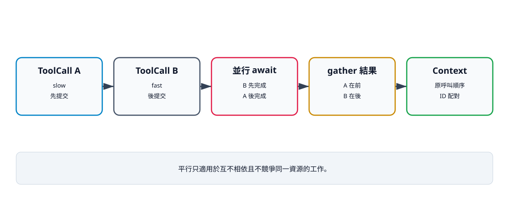

# 15. 循序與平行工具

## 本章目標

比較兩種執行模式的相依性、延遲、結果順序與安全風險。讀完本章後，你應能：

- 判斷工具是否互不相依；
- 解釋 `asyncio.gather()` 的回傳順序；
- 保留模型原始 ToolCall 順序；
- 避免同一資源的平行寫入競態；
- 確認 Validation 與 Hook 在兩種模式都執行。

## 兩種模式

`AgentConfig.tool_execution` 只能是 `sequential` 或 `parallel`：

```python
from dataclasses import dataclass


@dataclass(frozen=True)
class AgentConfig:
    tool_execution: str = "sequential"

    def __post_init__(self) -> None:
        if self.tool_execution not in {"sequential", "parallel"}:
            raise ValueError(
                "tool_execution must be sequential or parallel"
            )
```

循序模式逐一 await；平行模式建立多個 awaitable 交給 `asyncio.gather()`：

```python
async def execute_calls(config, assistant, execute):
    if config.tool_execution == "parallel":
        return await asyncio.gather(
            *(execute(call) for call in assistant.tool_calls)
        )
    return [await execute(call) for call in assistant.tool_calls]
```

## 完成順序不等於回傳順序

`gather()` 會讓任務同時進行，但回傳 list 仍按傳入 awaitable 的順序排列。這讓 ToolResult 在 Context 中維持模型原始呼叫順序，不依賴作業系統排程。



文字摘要：平行模式改變完成時間，不改變結果排列契約。只有互不相依且不競爭同一資源的工具適合平行；Write 後接 Edit 等流程仍須循序。

```python
import asyncio


async def work(label: str, delay: float) -> str:
    await asyncio.sleep(delay)
    return label


async def main() -> None:
    results = await asyncio.gather(
        work("slow", 0.02),
        work("fast", 0),
    )
    print(results)


asyncio.run(main())
```

預期輸出：

```text
['slow', 'fast']
```

fast 先完成，結果仍位於第二格。call ID 則提供語意配對，兩者都不能省略。

## 先畫相依圖，再決定模式

適合平行：

- 讀取兩個互不相依檔案；
- 執行兩個不改狀態的檢查；
- 查詢兩個互不相依來源。

不適合平行：

- Write 建立檔案後，Read 才能讀；
- Write 後接 Edit；
- 兩個 Edit 修改同一檔案；
- 第二個命令依賴第一個命令輸出；
- 共用無鎖的可變物件。

「工具名稱不同」不代表沒有相依性；應看它們讀寫的資源。即使選 sequential，同一個 AssistantMessage 內的第二個 ToolCall 也是模型事先決定的，模型不會在兩個 call 中間看到第一個結果。若第二步需要根據第一步結果重新決策，必須分成下一個模型回合。

目前 Validation 也不檢查同一批呼叫是否使用重複 call ID；重複 ID 會讓事件與結果相關性變得模糊，正式 Adapter 或批次驗證層應明確拒絕。

## 安全檢查不因平行而消失

每個 call 都進入同一個 `execute(call)`：Validation、Safety Hook、取消檢查、事件、逾時與錯誤轉換逐項執行。平行模式只是同時 await 多個 wrapper，不是繞過 wrapper。

不過 Hook 本身若讀寫共享狀態，也必須能處理並行。例如「剩餘配額」若沒有鎖，兩個工具可能同時通過檢查。

## 錯誤與取消

正式 wrapper 把一般工具例外轉成 ToolResult，因此一個工具失敗時，其他工具通常仍可完成。`AgentCancelled` 不屬於一般 `Exception`，取消可能使整個 gather 結束。對已產生副作用的任務，仍需要工具層清理或交易策略。

## 驗證命令

```bash
uv run --extra test pytest   tests/test_agent_controls.py::test_parallel_tool_results_keep_model_call_order   -q
uv run python examples/v07_parallel_order.py
```

## 決策表

| 問題 | 是 | 否 |
|---|---|---|
| 工具之間有資料相依？ | sequential | 繼續判斷 |
| 會寫同一資源？ | sequential／加鎖 | 繼續判斷 |
| Hook 或配額狀態可安全並行？ | 繼續判斷 | sequential |
| 失敗可彼此獨立處理？ | parallel 可考慮 | sequential |
| 延遲改善值得複雜度？ | parallel | sequential |

## 檢查清單

- [ ] 先辨認讀寫集合與資料相依。
- [ ] 結果維持原 ToolCall 順序。
- [ ] 每個 call 都執行 Validation 與 Hook。
- [ ] 同一檔案不在無鎖狀態平行修改。
- [ ] 取消與部分副作用有清理策略。
- [ ] 測試不依賴任務實際完成順序。

## 練習

1. **基礎：延遲工具。** 交換 slow/fast 的延遲，確認結果仍按呼叫順序。
2. **進階：資源分類。** 為 Read、Write、Edit、Bash 列出讀寫集合，再決定哪些能平行。
3. **挑戰：檔案鎖。** 依正規化路徑建立 async lock，避免同一目標同時寫入。

## 本章小結

平行執行改善的是互不相依工作的等待時間，不是所有工作的正確性。穩定結果順序、call ID、共享狀態與副作用清理，都是平行模式的必要契約。

## 本章驗收

- 能用依賴關係選擇 sequential 或 parallel。
- 平行測試證明完成順序不同但結果順序穩定。
- 能說明同檔 Write/Edit 的競態。
- 能指出 Hook 共享狀態也可能需要鎖。
