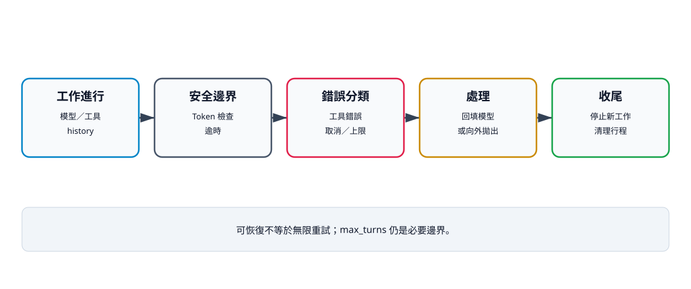

# 16. 中止、錯誤與恢復

## 本章目標

建立能被操作者停止、能回報錯誤、又不會無限重試的 Agent。讀完本章後，你應能：

- 使用 `CancellationToken` 表達停止要求；
- 分辨合作式取消與強制終止；
- 區分可恢復工具錯誤、逾時、取消與最大回合；
- 說明取消檢查的安全邊界；
- 設計不留下背景副作用的清理流程。

## 合作式取消

```python
import asyncio


class AgentCancelled(asyncio.CancelledError):
    def __init__(self, reason: str = "agent cancelled"):
        super().__init__(reason)
        self.reason = reason


class CancellationToken:
    def __init__(self) -> None:
        self._cancelled = False
        self.reason = "agent cancelled"

    def cancel(self, reason: str = "agent cancelled") -> None:
        self._cancelled = True
        self.reason = reason

    def raise_if_cancelled(self) -> None:
        if self._cancelled:
            raise AgentCancelled(self.reason)
```

呼叫端持有 Token，Loop 在每回合模型呼叫前與每個工具開始前檢查。這是合作式取消：程式只在預先安排的安全邊界停止。

## 取消時間軸

```text
使用者要求停止
→ token.cancel(reason)
→ 下一個 raise_if_cancelled()
→ AgentCancelled
→ 呼叫端清理 UI／行程／暫存狀態
```

如果同步工具正在長時間運算，Token 不會神奇地中斷它。工具本身必須定期檢查、使用可取消 await，或由子行程控制負責終止。



文字摘要：一般工具錯誤可以交回模型修正，但仍受最大回合限制。主動取消不包裝成普通錯誤；逾時與取消後也要確保 await、子行程與後續工作停止。

## 為什麼取消不是普通錯誤

在目前 Python 版本中，`asyncio.CancelledError` 繼承 `BaseException`，不是一般 `Exception`。Loop 的一般錯誤捕捉不會把 `AgentCancelled` 包成 `ToolResultMessage(is_error=True)`；取消會向外傳遞，讓呼叫端知道整個工作應停止。

可恢復工具錯誤則不同：路徑錯誤、參數錯誤或工具例外可以回填給模型，讓下一回合修正。

## 錯誤分類

| 類型 | 例子 | 目前行為 | 是否讓模型修正 |
|---|---|---|---:|
| Validation | 未知工具、arguments 錯誤 | 錯誤結果 | 是 |
| Safety 拒絕 | Hook 回傳 False | 錯誤結果 | 視政策 |
| 工具錯誤 | 唯一匹配失敗 | 錯誤結果 | 是 |
| 工具逾時 | `wait_for` 超時 | 錯誤結果 | 可調整策略 |
| 主動取消 | 操作者停止 | `AgentCancelled` | 否 |
| 最大回合 | 持續要求工具 | `RuntimeError` | 否 |

## 逾時與行程清理

Agent Loop 以 `asyncio.wait_for()` 限制每個工具 await。若外層 `wait_for()` 直接逾時，Loop 會把例外的 `str(exc)` 放進錯誤結果；某些 `TimeoutError` 的字串可能是空的，所以目前不能保證模型一定得到清楚逾時訊息。BashTool 另外在自己的逾時處理中提供明確訊息：

```python
async def communicate_with_timeout(process, timeout_seconds):
    try:
        return await asyncio.wait_for(
            process.communicate(), timeout_seconds
        )
    except asyncio.TimeoutError:
        process.kill()
        await process.wait()
        raise TimeoutError("command timed out")
```

kill 後仍要 wait，否則可能留下 zombie process。若行程又建立子行程，只殺父行程可能不夠，正式版要處理 process group。

## 取消測試

現有測試在 Safety Hook 中呼叫 `token.cancel()`。Hook 回傳允許後，Loop 於工具開始前再次檢查 Token，因此工具不會執行，模型也不會進入下一回合。

```bash
uv run --extra test pytest tests/test_cancellation.py -q
uv run python examples/v08_cooperative_cancel.py
```

## 最小恢復策略

第一版保留已完成 history，將可恢復工具錯誤交回模型，再以 `max_turns` 限制嘗試次數。尚未支援：

- 重新啟動後斷點恢復；
- 多檔交易回滾；
- Context 壓縮後的精確重播；
- 外部副作用冪等鍵；
- 分散式工作租約。

不要把「history 還在記憶體」寫成已完成 durable recovery。

## 檢查清單

- [ ] 模型回合前檢查取消。
- [ ] 工具開始前再次檢查取消。
- [ ] 取消不包成普通工具錯誤。
- [ ] 逾時後 await 與子行程均停止。
- [ ] 一般錯誤保留 call ID 與 `is_error=True`。
- [ ] `max_turns` 防止無限修正。
- [ ] 檔案不誤稱支援持久化恢復。

## 練習

1. **基礎：取消理由。** 驗證 `AgentCancelled.reason` 保留操作者文字。
2. **進階：可取消工具。** 寫一個分段工作工具，每段前檢查 Token。
3. **挑戰：冪等恢復。** 為外部寫入設計 operation ID，避免重啟後重複副作用。

## 本章小結

可停止性是 Agent 的核心功能。合作式取消需要明確檢查點，逾時需要清理行程，錯誤恢復需要次數上限。沒有這些邊界，Agent 只能靠強制殺掉整個行程停止。

## 本章驗收

- 取消測試證明工具與下一次模型呼叫都不會開始。
- 能區分錯誤結果、逾時、取消與最大回合。
- 能說明 kill 後仍需 wait。
- 能指出目前恢復只存在於記憶體 history。
