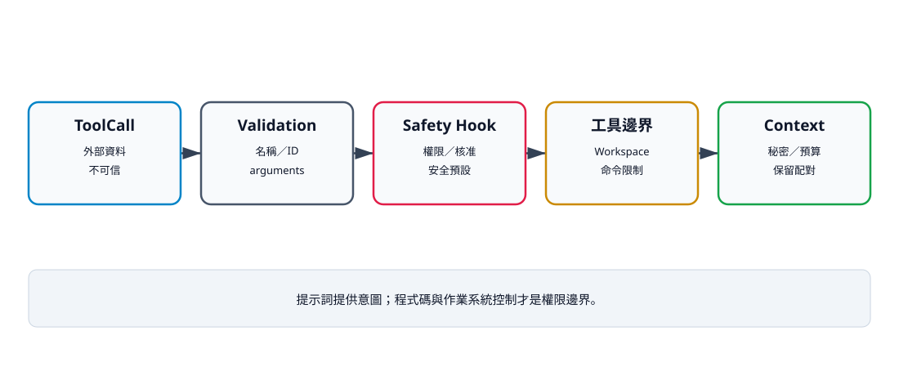

# 17. 安全攔截、權限與 Context 管理

## 本章目標

把「請模型小心」改成程式碼可強制、可測試、可稽核的控制。讀完本章後，你應能：

- 分辨 Validation、Workspace、Safety Hook 與工具內檢查；
- 建立安全預設與明確擴權；
- 在副作用前拒絕工具；
- 說明 Context 中的秘密、成本與配對限制；
- 列出目前原型未完成的安全控制。

## 安全不是單一開關

本書使用分層防線：

```text
供應商 Adapter／ToolCall 外形
→ Validation
→ Safety Hook
→ Registry
→ Tool 欄位與 Workspace 邊界
→ 作業系統／行程限制
→ ToolResult 與事件稽核
```

每一層只能回答自己的問題。Validation 知道 ID 與 arguments 外形，卻不知道使用者是否核准覆寫；Workspace 知道路徑位置，卻不知道檔案是否含秘密。



文字摘要：提示詞只描述意圖。結構驗證、權限政策、Workspace、命令限制與 Context 資料政策共同形成安全邊界；任何一層都不能替代其他層。

## 三道核心邊界

| 邊界 | 問題 | 失敗例子 |
|---|---|---|
| Validation | 呼叫結構是否有效？ | 未知工具、空 ID、arguments 非 object |
| Safety Hook | 這次操作是否獲准？ | 唯讀模式拒絕 write |
| Tool／Workspace | 具體欄位與副作用是否安全？ | `../outside`、多重 Edit 匹配 |

Hook 可以同步或非同步：

```python
async def allow_read_only(_id: str, name: str, _args: dict) -> bool:
    return name in {"calculator", "read"}
```

Hook 回傳 False 時，Loop 產生錯誤結果，工具本身不會執行。這個順序已有測試證明。但 Hook 是選配參數：呼叫端沒有傳入 `before_tool_call` 時，目前 Loop 不是預設拒絕，而是直接進入工具階段。下表描述的是建議政策，必須由組裝根實際注入才能成立。

## 權限決策表

| 工具／情況 | 安全預設 | 建議核准 | 補充控制 |
|---|---|---|---|
| Calculator | 允許 | 否 | 數值與操作 allowlist |
| Read | Workspace 內 | 敏感檔案需要 | 大小限制、秘密遮罩 |
| Write | 拒絕或詢問 | 是 | diff、備份、條件覆寫 |
| Edit | 拒絕或詢問 | 是 | 唯一匹配、修改後測試 |
| Bash | 最小 allowlist | 是 | argv 規則、容器、網路限制 |
| 未知工具 | 拒絕 | 不自動擴權 | 先更新程式與政策 |

政策應 fail-closed。模型不能因「完成任務需要」就自行擴大權限；目前原型不會自動建立這項預設，責任仍在呼叫端。

## Context 也是安全邊界

Context 可能包含：

- 使用者輸入；
- 原始碼與設定檔；
- 工具錯誤；
- 路徑與命令輸出；
- 可能的秘密；
- 模型先前產生的不可信內容。

目前 `convert_to_llm()` 只序列化 messages：

```python
from dataclasses import dataclass, field
from typing import Any


@dataclass
class AgentContext:
    messages: list = field(default_factory=list)
    system_prompt: str = ""
    metadata: dict[str, Any] = field(default_factory=dict)

    def convert_to_llm(self) -> list[dict[str, Any]]:
        return [message.to_dict() for message in self.messages]
```

`system_prompt` 與 metadata 不會由這個方法自動送給模型。Adapter 若需要它們，必須明確組裝；不要在書中假設 system prompt 已傳送。

`AgentContext.copy()` 也只是外層容器淺拷貝：messages list 與 metadata dict 會建立新容器，但訊息物件及 metadata 內的巢狀可變值仍可能共用。

## 預算與壓縮

第一版可先以 messages 數與字元數建立可測量上限：

```python
def within_context_budget(
    messages: list,
    max_messages: int = 40,
    max_chars: int = 60_000,
) -> bool:
    if len(messages) > max_messages:
        return False
    return sum(len(str(message)) for message in messages) <= max_chars
```

這不是精準 token 計算，也尚未整合到核心 Loop。它只是教學用決策函式。真正壓縮時必須保留：

- 目前任務與最新使用者要求；
- 尚未配對的 ToolCall／ToolResult；
- 最近副作用的證據；
- 需要稽核的政策拒絕；
- 讓後續工具參數可重建的必要內容。

直接刪掉舊訊息可能破壞 call ID 配對或讓模型重複副作用。

## 秘密與提示注入

Workspace 內不代表內容可安全送給模型。Read 可能讀到 `.env`、私鑰或惡意檔案指令。工具輸出是資料，不是新的系統指令。正式版需要檔名政策、內容遮罩、秘密掃描與明確資料流核准。現在一般工具例外的 `str(exc)` 也會原樣回填模型，可能包含本機路徑、stderr 或其他敏感資訊。

目前原型沒有完整 prompt-injection 防禦、秘密分類或細粒度 ACL，不能宣稱已達企業安全等級。

## 驗證命令

```bash
uv run --extra test pytest \
  tests/test_agent_controls.py \
  tests/test_safety.py \
  -q
uv run python examples/v09_safety_policy.py
```

## 檢查清單

- [ ] Validation、政策與業務欄位分層。
- [ ] Hook 位於任何工具副作用之前。
- [ ] Workspace 邊界由程式碼強制。
- [ ] Read 內容不自動升級為指令。
- [ ] Context 壓縮保留 ToolCall 配對。
- [ ] system prompt／metadata 的傳送行為描述正確。
- [ ] 檔案明確列出秘密與 prompt injection 限制。

## 練習

1. **基礎：唯讀 Hook。** 允許 Calculator／Read，拒絕 Write／Edit／Bash。
2. **進階：敏感路徑。** 在 Workspace 內拒絕 `.env`、`.git` 與私鑰副檔名，先寫負向測試。
3. **挑戰：Context 壓縮。** 設計摘要演算法，證明不會拆散 ToolCall／ToolResult，也不會遺失最近副作用。

## 本章小結

Agent 安全來自多層可執行控制。提示詞只能提供意圖，Validation、Hook、Workspace、行程隔離與 Context 政策才是邊界。安全工作也不會在工具執行後結束；結果如何保存、傳送與壓縮同樣重要。

## 本章驗收

- 能指出每種檢查所在層級。
- Hook 拒絕時工具確實未執行。
- 能說明 Workspace 內資料仍可能敏感或惡意。
- 能列出目前原型至少四項安全限制。
