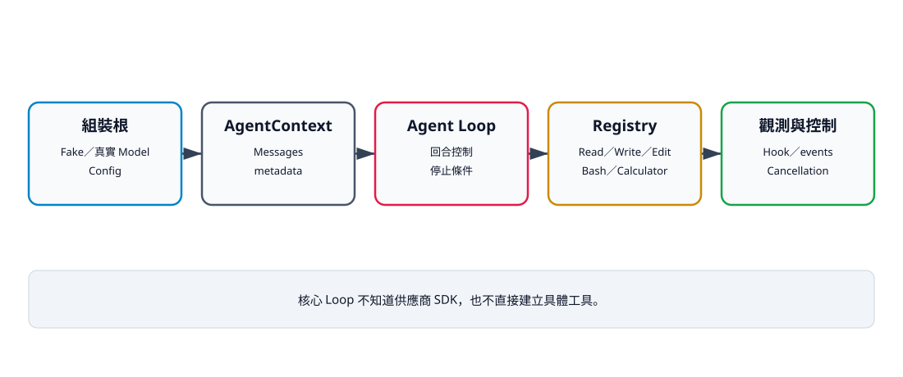

# 18. 完成迷你 Python Coding Agent

## 本章目標

把全書元件組成一個可執行、可測試、可觀察、可停止且有安全邊界的迷你 Coding Agent。讀完本章後，你應能：

- 組裝 Model、Context、Registry、Config、Hook、事件與取消；
- 執行 Write → Edit → Read 的完整閉環；
- 用 FakeModel 驗證核心，不需要 API Key；
- 在不修改 Loop 的情況下替換 ModelClient；
- 分辨教學原型與可上線產品之間的差距。

## 最終組件圖

```text
呼叫端／組裝根
├─ ModelClient（測試：FakeModel；正式：供應商 Adapter）
├─ AgentContext
├─ ToolRegistry
│  ├─ Calculator
│  ├─ Read／Write／Edit
│  └─ Bash（受限模式）
├─ AgentConfig
├─ before_tool_call Safety Hook
├─ AgentEvent collector
└─ CancellationToken
           ↓
      run_agent_loop()
           ↓
   history／ToolResult／最終回答
```

核心 Loop 不建立這些物件。呼叫端負責組裝，因此測試可注入 FakeModel、暫存 Workspace 與固定政策。



文字摘要：呼叫端建立並注入所有依賴。Agent Loop 只控制回合與停止條件，Registry 分派工具，Hook 與取消控制副作用，事件與 history 留下可觀察證據。

## V10 完整範例

```python
from __future__ import annotations

import asyncio
import tempfile
from pathlib import Path

from mini_agent.agent_loop import run_agent_loop
from mini_agent.cancellation import CancellationToken
from mini_agent.config import AgentConfig
from mini_agent.context import AgentContext
from mini_agent.events import AgentEvent
from mini_agent.messages import AssistantMessage, ToolCall, UserMessage
from mini_agent.model_client import FakeModel
from mini_agent.tools import EditTool, ReadTool, ToolRegistry, WriteTool


async def main() -> None:
    with tempfile.TemporaryDirectory() as directory:
        workspace = Path(directory)
        model = FakeModel([
            AssistantMessage("", [ToolCall(
                "write-1", "write",
                {"path": "app.py", "content": "print('draft')\n"},
            )]),
            AssistantMessage("", [ToolCall(
                "edit-1", "edit",
                {"path": "app.py", "old": "draft", "new": "ready"},
            )]),
            AssistantMessage("", [ToolCall(
                "read-1", "read", {"path": "app.py"},
            )]),
            AssistantMessage("完整 Agent 已完成。"),
        ])
        events: list[AgentEvent] = []
        allowed = {"write", "edit", "read"}
        history = await run_agent_loop(
            model,
            AgentContext([UserMessage("建立、修改並驗證 app.py")]),
            ToolRegistry([
                WriteTool(workspace),
                EditTool(workspace),
                ReadTool(workspace),
            ]),
            AgentConfig(max_turns=6),
            before_tool_call=lambda _id, name, _args: name in allowed,
            events=events,
            cancellation=CancellationToken(),
        )
        print(history[-1].content)
        print((workspace / "app.py").read_text(encoding="utf-8").strip())
        print(f"events={len(events)}")


if __name__ == "__main__":
    asyncio.run(main())
```

預期輸出：

```text
完整 Agent 已完成。
print('ready')
events=6
```

三個工具各產生 start/end，因此事件數為 6。若前置 Validation 或 Hook 拒絕呼叫，目前事件契約可能只產生 end；不要把 `events=6` 當成所有情況的固定公式。

V10 是 FakeModel 驅動的確定性 Workspace 整合例，不是互動式產品。它只註冊 Write、Edit、Read；沒有註冊 Calculator 或 Bash，沒有使用平行模式，也沒有實際觸發 timeout、取消、Context 壓縮或真實網路模型。範例傳入 Config、Hook、事件與 Token，代表組裝邊界存在，不代表每條控制路徑都已在 V10 展示。

## 從限制清單到可執行原型

本書另提供 `manuscript/appendices/advanced-production-examples.md`，將八項產品化缺口拆成可執行範例：

- 無金鑰 Recording Adapter；
- 可注入 input／output 的互動式 CLI；
- 完整 Registry 與獨立授權政策；
- 不經 shell 的 structured-command runner；
- Condition＋deque 有界事件串流原型；
- Context 測量與壓縮純函式；
- SQLite checkpoint 與冪等 replay；
- staging Workspace 多檔交易與回滾。

這些範例位於 `examples/advanced/`，並由四個進階測試檔驗收：Adapter／CLI、Registry／Runner、Stream／Context、Checkpoint／Transaction。它們沒有被直接塞進 V10，也沒有改變穩定核心 API；讀者可先理解每個邊界，再決定是否整合。

## 從 V0 到 V10

| 版本 | 新增能力 | 主要驗收 |
|---|---|---|
| V0 | 單次聊天基準 | 可觀察沒有工具閉環 |
| V1 | FakeModel Loop | 工具結果進入下一回合 |
| V2 | Workspace 工具 | 檔案只在暫存根目錄 |
| V3 | Agent＋檔案整合 | Write／Edit／Read |
| V4 | 事件、平行、取消基礎 | 控制面可測試 |
| V5 | 錯誤恢復與最大回合 | 不無限重試 |
| V6 | 事件消費端 | 外部不讀 Loop 內部狀態 |
| V7 | 平行結果順序 | slow／fast 仍穩定排列 |
| V8 | 合作式取消 | 下一安全邊界停止 |
| V9 | Safety Hook | 拒絕發生在工具前 |
| V10 | 完整組裝 | 建立、修改、讀回與最終回答 |

## 替換真正模型

Adapter 只需符合：

```python
from typing import Protocol


class ModelClient(Protocol):
    async def complete(self, context: AgentContext) -> AssistantMessage:
        ...
```

Adapter 負責認證、HTTP、供應商訊息格式、工具 schema、重試與串流轉換。API Key 不應進入 AgentContext、工具或 Loop。即使加入真實 Adapter，核心測試仍使用 FakeModel。

## 實際驗證

```bash
uv run python examples/v10_complete_agent.py
uv run python scripts/verify_examples.py .
uv run --extra test python scripts/verify_all.py .
```

完成標準是 V0～V10 return code 全為 0、輸出符合 manifest、40 項以上測試通過，且統一驗證為 `valid=True`。測試數會隨版本增加，書稿不應把舊數字當成永久契約。

## 上線前差距

目前原型尚未完成：

- 真實供應商 Adapter 與串流 API；
- Context token 預算與壓縮整合；
- 秘密掃描、細粒度 ACL 與 prompt-injection 防禦；
- Bash 容器隔離、argv 規則與 process-group 清理；
- 多檔交易、持久化 checkpoint 與冪等恢復；
- telemetry、速率限制、發行 tag 與相容性政策。

訊息目前只有 `to_dict()`，沒有反序列化、schema version 或持久化格式；工具欄位也沒有完整 runtime schema。真實 Adapter 還必須處理 system prompt 與工具 schema 映射、finish reason、畸形 payload、rate limit、usage 與秘密清理，不能只包一層 HTTP。

因此它是可驗證的教學原型，不是可直接部署到不可信環境的成品。

## 發行前檢查清單

- [ ] 所有可執行範例與測試在乾淨環境通過。
- [ ] 書稿引用的 API 與目前程式一致。
- [ ] 工具都有正常、錯誤與安全邊界測試。
- [ ] Context、秘密與日誌有資料政策。
- [ ] 真實 Adapter 不讓供應商細節滲入 Loop。
- [ ] 發行使用 Git tag／Release，不引用未固定 main。
- [ ] EPUB、圖解、metadata 與無障礙檢查完成。

## 練習

1. **基礎：版本回顧。** 執行 V0～V10，為每版記錄一項能力與一項安全邊界。
2. **進階：ListFilesTool。** 只列 Workspace 相對路徑，先測 `..`、符號連結與排序。
3. **挑戰：Model Adapter。** 實作供應商 Adapter，但核心測試仍不用網路或 API Key；記錄重試、截斷與工具格式轉換。

## 本章小結

完整 Agent 不是單一巨大類別，而是一組可替換、可驗證的元件。Model 做決策，Loop 控制回合，Registry 分派工具，Hook 與 Workspace 限制副作用，事件與 history 提供證據。這個邊界讓教學原型能逐步演進，而不必重寫核心。

## 本章驗收

- V10 實際輸出最終回答、修改後檔案與 6 個事件。
- V0～V10 範例與統一驗證全部通過。
- 能在不改 Loop 的情況替換 ModelClient。
- 能清楚區分目前完成能力與上線前缺口。
